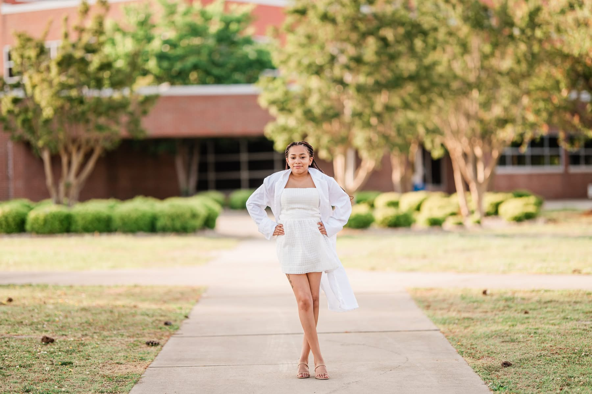

<html lang="en">
<head>
<meta charset="UTF-8">
<meta name="viewport" content="width=device-width, initial-scale=1.0">

<title>Sydney Riddick | Portfolio</title>

</head>

<body>
<header>

🌸

🌸

<h1>Sydney Riddick</h1>

Graduate Biology Student • Cum Laude • STEM Researcher

<a href="Resume%20Updated%202024.pdf" target="_blank">
📄 View Resume
</a>

<a href="https://www.linkedin.com/in/sydney-riddick-6177a52b1"
target="_blank">
💼 LinkedIn
</a>

</header>

<section>

<h2>Professional Statement</h2>

Motivated graduate student with experience in customer service, education, biotechnology training, STEM research, and healthcare support. Passionate about scientific innovation, lifelong learning, and helping others while continuing to develop professionally. I strive to apply leadership, communication, and problem-solving skills in every opportunity and am eager to contribute to the future of biomedical applications and biotechnology.

</section>
<section id="about">

<h2>🌼 About Me</h2>

Hello, my name is Sydney Riddick. I'm from North Carolina, and I'm 23 years old. I have two younger siblings, a brother and a sister. Spending time with family and friends is one of the most important things to me.
 Before coming to Elizabeth City State University, I attended College of the Albemarle, where I earned my associate's degree in Biology. After graduating, I transferred to ECSU and earned my bachelor's degree in General Biology with minors in Chemistry and Sustainability. I graduated from ECSU in May 2025, and I am now pursuing a Master's degree in Biology at ECSU. During my time at ECSU, I have been a chemistry tutor, attended the Biopharmaceutical Manufacturing Program at the Scientific Gateway Coding Institute, and assisted with teaching biology labs. 
While working toward my master's degree, I have been conducting research focused on how efficiently bacteria from the Roseobactor clade can efficiently degrade polycyclic aromatic hydrocarbons, which are harmful pollutants that negatively affect human health and harm the environment and marine life. 
My time in college hasn't always been easy, but I have found joy in the people I have met along the way and the opportunities I have gained. I look forward to continuing my education, expanding my research experience, and building a career that combines science, research, and helping others.

</section>
<section>

<h2>Projects</h2>

<h3>AI & Machine Learning Exploration</h3>

Completed Google's Artificial Intelligence Certificate program, gaining
foundational knowledge in artificial intelligence, machine learning concepts,
prompt engineering, and responsible AI.

<h3>Biopharmaceutical Manufacturing Training</h3>

Completed hands-on training in biopharmaceutical manufacturing, learning
laboratory procedures, quality control principles, biotechnology processes,
and Good Manufacturing Practices (GMP).

<h3>STEM Research & LSAMP Scholar</h3>

Participated in the Louis Stokes Alliance for Minority Participation (LSAMP)
program at Elizabeth City State University. Collaborated with faculty and fellow
students to strengthen research, scientific communication, and problem-solving
skills while promoting diversity in STEM.

<h3>Graduate Portfolio Website</h3>

Designed and developed a personal GitHub Pages portfolio website using HTML
and CSS to showcase my resume, professional experience, certifications,
projects, and contact information.

</section>

<section>

<h2>Education</h2>

<ul>

<li><strong>Elizabeth City State University</strong> – Master's Degree (Current)</li>

<li><strong>Elizabeth City State University</strong> – Bachelor's Degree</li>

<li><strong>College of The Albemarle</strong> – Associate's Degree</li>

<li><strong>The Albemarle School</strong> – High School Diploma</li>

</ul>

</section>

<section>

<h2>Certifications & Programs</h2>

<ul>

<li>Google Artificial Intelligence Certificate</li>

<li>Biopharmaceutical Manufacturing Certificate</li>

<li>Louis Stokes Alliance for Minority Participation (LSAMP)</li>

<li>Student Government Association</li>

<li>Beta Club</li>

</ul>

</section>

<section>

<h2>Skills</h2>

<ul>

<li>Leadership</li>

<li>Communication</li>

<li>Problem Solving</li>

<li>Customer Service</li>

<li>Time Management</li>

<li>Microsoft Office</li>

<li>Attention to Detail</li>

<li>Computer Skills</li>

<li>Organization</li>

<li>Quick Learner</li>

</ul>

</section>

<section>

<h2>Contact</h2>

📧 <strong>Email:</strong> Sydneyelle03@icloud.com

📞 <strong>Phone:</strong> 252-267-3619

💼 <strong>LinkedIn:</strong>

<a href="https://www.linkedin.com/in/sydney-riddick-6177a52b1" target="_blank">

linkedin.com/in/sydney-riddick-6177a52b1

</a>

</section>

<footer>

© 2026 Sydney Riddick • Created with HTML & CSS • 🌸 Thank you for visiting!

</footer>
